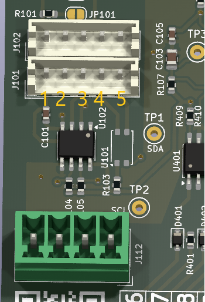
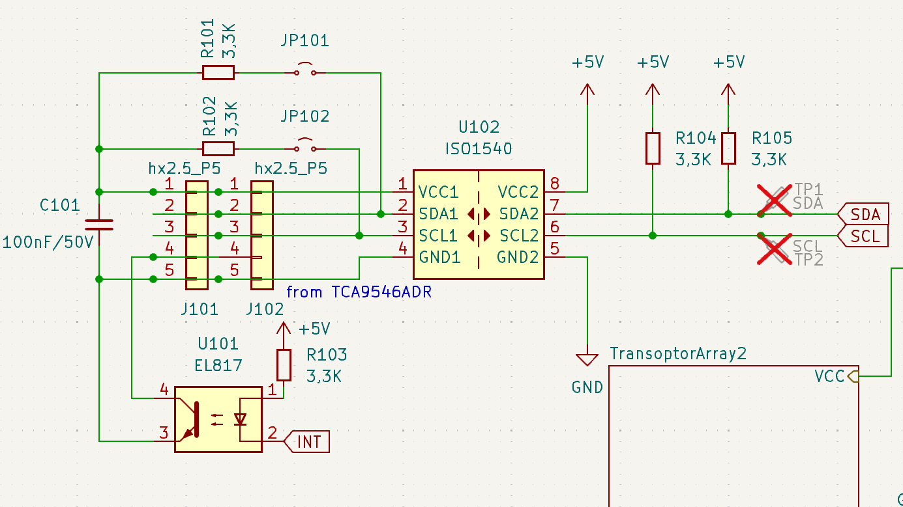

# 32-channel I2C input module

## General information about the module.

This module is based on two TCA6416A chips.   

* Supply voltage: 24VDC.
* Input voltage: 0V to 24V.
* It has a common interrupt signal.
* It has galvanic isolation for I2C signals by ISO1540.
* It has galvanic isolation for the INT signal by optocoupler.
* Each channel has galvanic isolation.
* Each channel has LED indication.
* One TCA6416 module has address 20 and the other has address 21.

## How use library

### Include Headers
The library contains a dependency on the TCA6416 library.   

        #include <TCA6416> 
        #include "Input_32chanel.h"

An example using interrupts.

        #include <Arduino.h>
        #include <Wire.h>
        #include <TCA6416A.h>
        #include "Input_32chanel.h"
        
        TCA6416A chanel0x20Obj(0x20);
        TCA6416A chanel0x21Obj(0x21);
        Input_32chanel myInput(chanel0x20Obj, chanel0x21Obj);
        
        uint8_t IRQpin = 2;
        
        void show(void);
        
        void ARDUINO_ISR_ATTR tca6416INT() {
          myInput.intFlag = true;
          myInput.timeToRead = millis() + 50;
        }
        
        void setup()
        {
        	Serial.begin(115200);
        
          pinMode(IRQpin, INPUT_PULLUP);
          attachInterrupt(digitalPinToInterrupt(IRQpin), tca6416INT, FALLING);
        
          if (myInput.begin(show) == false){
            Serial.println("TCA6416 problem");
            while (1);    
          }
        }
        
        void loop(){
        myInput.loop();
        }
        
        
        void show(){
           Serial.print("chanel \t"); 
           for (size_t i = 0; i < 32; i++){
             Serial.print(i); Serial.print("\t"); 
            }
            Serial.println("");
            Serial.print("value  \t"); 
          for (size_t i = 0; i < 32; i++){
            bool val = myInput.getChanelValue(i);
            Serial.print(val); Serial.print("\t"); 
          }
          Serial.println("\n");
        }

You can register your own function in the begin function.   
Your function will be called whenever the input state changes.

        myInput.begin(pointer_to_the_own_function)

## Hardware
The bus I2C can be connected via connectors J101 or J102;    

    

The board fits perfectly into the housing  DM108-0080-14-100Z(H)

.png)

