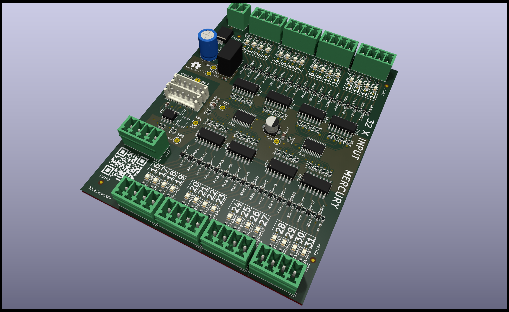

# 32-channel I2C input module

## General information about the module.

This module is based on two TCA6416A chips.   

* Supply voltage: 24VDC.
* Input voltage: 0V to 24V.
* It has a common interrupt signal.
* It has galvanic isolation for I2C signals.
* It has galvanic isolation for the INT signal.
* Each channel has galvanic isolation.
* Each channel has LED indication.
* One TCA6416 module has address 20 and the other has address 21.

## How use library

### Include Headers
The library contains a dependency on the TCA6416 library.   

        #include \<TCA6416\> 
        #include "Input_32chanel.h"

For each TCA6416 Create object.
Then create an input module object.

        TCA6416A chanel0x20Obj;
        TCA6416A chanel0x21Obj;
        Input_32chanel myInputArray(chanel0x20Obj, chanel0x21Obj);

